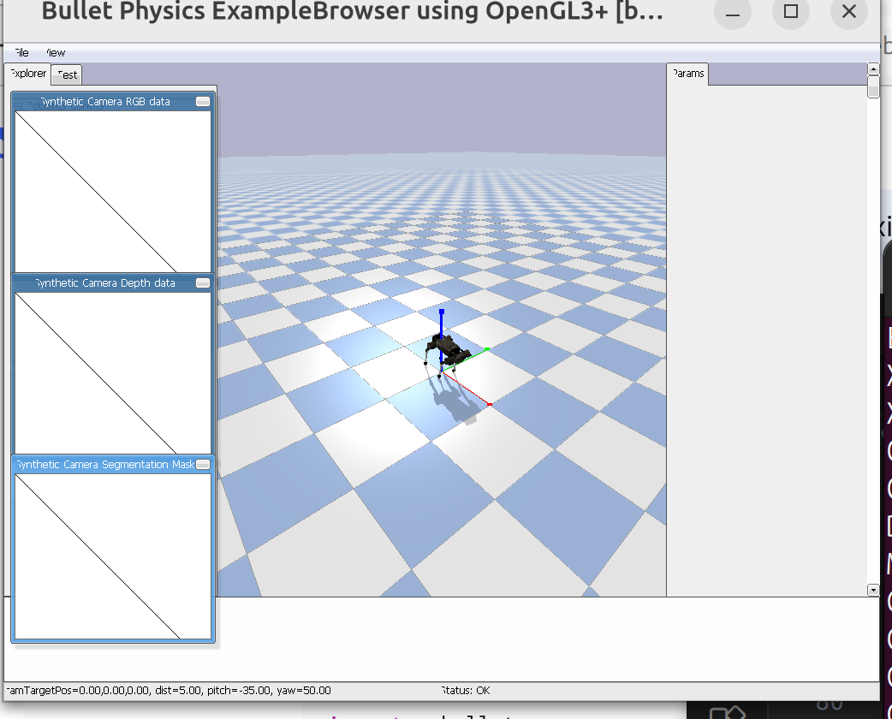

# 📝 Week 13 实验汇报：四足机器人入门与 Trot 步态控制仿真
## 1. 实验目标
在 PyBullet 物理引擎中成功加载宇树 Laikago（四足机器狗）的 URDF 模型。

理解四足机器人经典的 Trot（小跑）步态 逻辑，掌握对角腿同步运动的相位设计。

编写简化版的逆运动学 (Inverse Kinematics) 核心控制脚本，实现机器狗的步态生成与闭环仿真。
## 2. 核心控制算法设计
本周实验通过自定义的 QuadrupedController 类实现了机器狗的运动控制，其核心逻辑包含以下两个关键点：🐕 2.1 Trot 步态相位划分Trot 步态是一种对角腿同步交替移动的步态。代码中通过对不同腿部赋予初始相位差 ($\pi$) 来实现协同：对角腿 1：左前腿 (LF) 与 右后腿 (RH) 同相。对角腿 2：右前腿 (RF) 与 左后腿 (LH) 存在 $\pi$ 的相位滞后。步态周期被严格划分为两个状态：摆动相 (Swing Phase)：腿部抬起，利用正弦曲线规律控制足端轨迹：$$z = \text{step\_height} \times \sin(\pi \times \text{progress})$$支撑相 (Stance Phase)：腿部着地并向后蹬，支撑身体向前推进 ($z = 0$)。📐 2.2 简化逆运动学 (IK)根据期望的足端轨迹 $(x, z)$，通过几何关系反算大腿（Thigh）和小腿（Calf）的关节旋转角度：大腿角：thigh = np.arctan2(x, target_height)小腿角：calf = -2 * thigh（通过几何比例进行连动简化）
## 3. 实验截图展示

*ArUco 标记成功被检测并标注 ID*

*基于像素宽度的距离估算结果*

*手机摄像头实时识别 ArUco 标记*

*检测算法在复杂场景下的验证结果*
建议：这里放置两张 PyBullet 的运行截图。一张是机器狗在平地上站立的初始姿态，另一张是运动起来、对角腿交替抬起时的动态瞬间。

左图：PyBullet 成功加载 laikago_toes.urdf 模型并保持 0.5 米初始高度。

右图：控制脚本驱动下，机器狗进入稳定的 Trot 步态交替踏步仿真。
## 4. 关键控制代码
import pybullet as p
import pybullet_data
import time
import numpy as np

# 初始化
p.connect(p.GUI)
p.setAdditionalSearchPath(pybullet_data.getDataPath())
p.setGravity(0, 0, -9.8)
p.loadURDF("plane.urdf")

# 加载机器人
robotId = p.loadURDF("laikago/laikago_toes.urdf", [0, 0, 0.5])

# 定义关节ID（根据模型不同可能需要调整）
# 假设每条腿3个关节：hip, thigh, calf
leg_joints = {
    'LF': [0, 1, 2],    # 前左腿
    'RF': [3, 4, 5],    # 前右腿
    'LH': [6, 7, 8],    # 后左腿
    'RH': [9, 10, 11]   # 后右腿
}

def simple_gait(t, leg_name, frequency=1.0):
    """
    生成简单的正弦波步态
    t: 时间
    leg_name: 'LF', 'RF', 'LH', 'RH'
    """
    # 不同腿的相位差（实现Trot步态）
    phase_offset = {
        'LF': 0,
        'RH': 0,        # 与LF同相位（对角线）
        'RF': np.pi,    # 相位差180度
        'LH': np.pi     # 与RF同相位（对角线）
    }

    phase = phase_offset[leg_name]

    # 关节角度（简化版）
    hip_angle = 0  # 髋关节保持中立
    thigh_angle = 0.3 * np.sin(2 * np.pi * frequency * t + phase)
    calf_angle = -0.6 * np.sin(2 * np.pi * frequency * t + phase)

    return [hip_angle, thigh_angle, calf_angle]

# 仿真循环
t = 0
dt = 1./240.

for _ in range(5000):
    # 为每条腿生成目标角度
    for leg_name, joint_ids in leg_joints.items():
        target_angles = simple_gait(t, leg_name, frequency=0.5)

        # 设置关节目标位置（位置控制）
        for joint_id, target_angle in zip(joint_ids, target_angles):
            p.setJointMotorControl2(
                robotId,
                joint_id,
                p.POSITION_CONTROL,
                targetPosition=target_angle,
                force=20  # 最大力矩
            )

    p.stepSimulation()
    time.sleep(dt)
    t += dt

p.disconnect()
## 5. 实验总结
本周实验让我真正接触到了四足机器人的底层控制核心。通过 PyBullet 的物理调试我发现，四足机器人的稳定性高度依赖于摆动相与支撑相的切换时机，以及力的反馈（force=20）。由于本周采用的是简化版的几何反算，机器狗虽然能迈步，但还无法实现非常完美的平稳前进。这为我后续研究更复杂的虚拟模型控制 (VMC) 和 模型预测控制 (MPC) 算法奠定了直观的基础。S
## 遇到的问题与解决

| 问题 | 原因 | 解决方案 |
|------|------|----------|
| ArUco 识别率低 | 光照不足或标记尺寸太小 | 增加光照，使用更大尺寸的标记 |
| 距离估算偏差大 | 焦距参数未标定 | 使用棋盘格标定获取精确焦距 |

## 总结与反思

ArUco 标记为机器人视觉定位提供了简单可靠的解决方案，结合距离估算可以实现基本的空间感知。

[← 返回首页](../)
