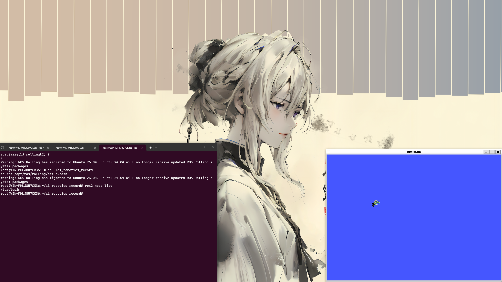

# Week 1 — 课程准备与工具安装

## 实验目标

本周主要完成课程前期的工具链准备，包括 GitHub 账号注册、VS Code 编辑器安装、Git 环境配置以及 SSH 密钥设置，确保后续每周作业能够顺利提交。

## 实验环境

| 组件 | 说明 |
|------|------|
| 代码托管 | GitHub |
| 编辑器 | VS Code |
| 版本管理 | Git |
| 认证方式 | SSH Key |

## 实验步骤

1. 注册 GitHub 账号并创建作业仓库
2. 安装 VS Code 并配置 Markdown 编辑环境
3. 配置 Git 全局用户名和邮箱
4. 生成 SSH 密钥并添加到 GitHub

## 关键命令

```bash
git config --global user.name "your-name"
git config --global user.email "your-email"
ssh-keygen -t ed25519 -C "your-email"
git clone git@github.com:your-repo.git
```

## 遇到的问题与解决

| 问题 | 原因 | 解决方案 |
|------|------|----------|
| SSH 连接失败 | 公钥未添加到 GitHub | 在 GitHub Settings → SSH Keys 中添加公钥 |
| git push 报权限错误 | 仓库 URL 使用了 HTTPS 而非 SSH | 切换为 SSH 地址或配置 credential |
| VS Code 中文乱码 | 文件编码不是 UTF-8 | 修改 VS Code 设置默认编码为 UTF-8 |

## 总结与反思

工具链的准备看似简单，但 Git、SSH 和编辑器的正确配置是整个学期顺利提交作业的基础。提前解决认证问题可以避免后续每周提交时的困扰。

## 实验截图





[← 返回首页](../)

工具链的完整配置确保了后续 ROS2、Docker 等复杂环境的顺利搭建，提前解决认证和编辑问题让每周作业提交更加高效。
