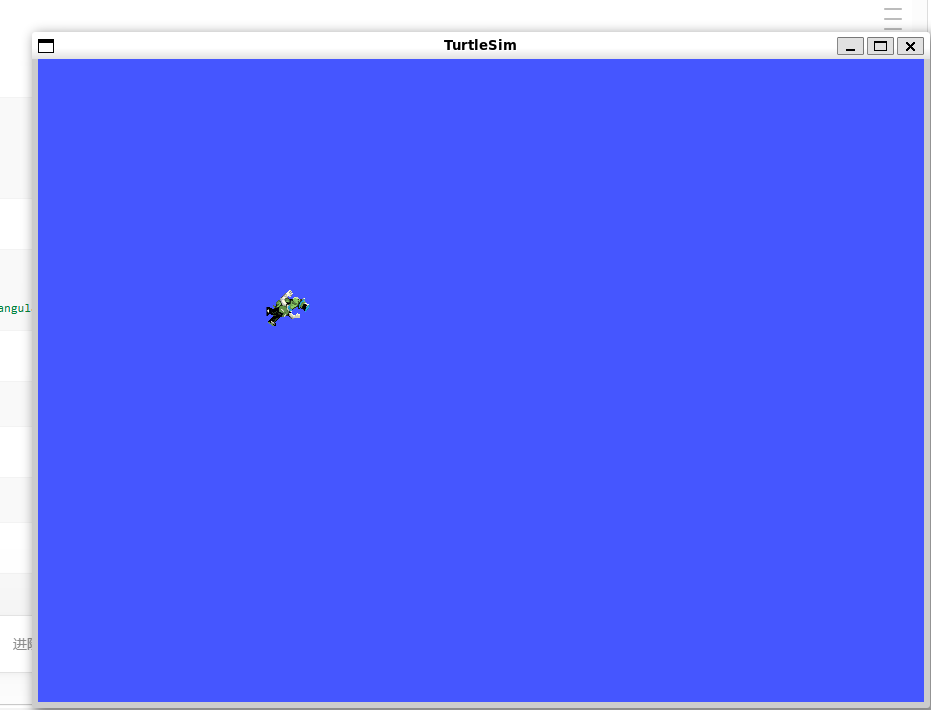
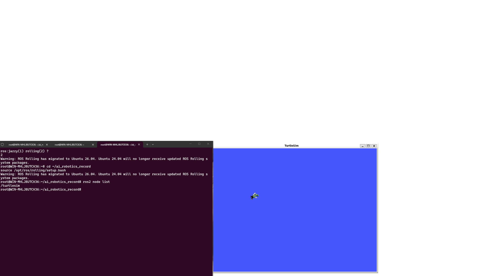

# Week 2：WSL、Ubuntu 与 ROS2 环境配置

## 实验内容

本周完成了以下任务：

1. 安装 WSL Ubuntu 22.04
2. 配置 ROS2 Humble 环境
3. 运行 turtlesim 小乌龟节点

## 实验截图

### Ubuntu 安装成功

### 小乌龟仿真运行

### 实验环境截图

## 运行命令

\`\`\`bash
# 启动小乌龟节点
ros2 run turtlesim turtlesim_node

# 启动键盘控制
ros2 run turtlesim turtle_teleop_key
\`\`\`

## 遇到的问题

1. **问题**：运行 `ros2` 命令提示 command not found
   **解决**：运行 `source /opt/ros/humble/setup.bash`

## 学习心得

通过本周学习，我掌握了 WSL 的基本使用和 ROS2 的安装配置...

## 返回

[← 返回首页](../)

## 延伸思考

ROS2 环境搭建是后续所有机器人实验的基础。WSL2 + Ubuntu 的方案让 Windows 用户无需双系统即可进行 ROS2 开发，turtlesim 作为验证工具简单直观，能快速确认环境是否正确配置。

同时，ROS2 的分布式架构设计使得后续可以轻松扩展传感器节点、控制节点和可视化节点，为复杂的机器人系统奠定了通信基础。

在实际操作中，turtlesim 小乌龟的成功运行标志着 ROS2 环境的完整可用，为 Week 3 的话题通信和后续的 Python 编程奠定了基础。
