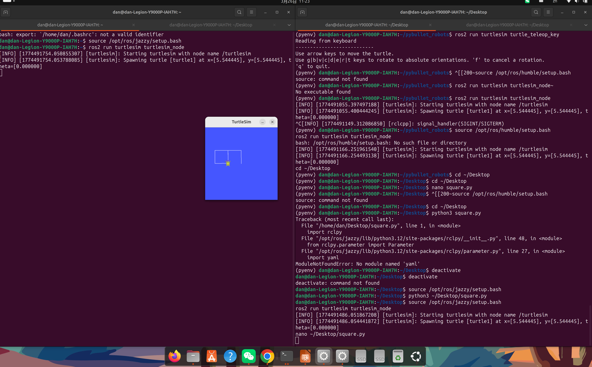
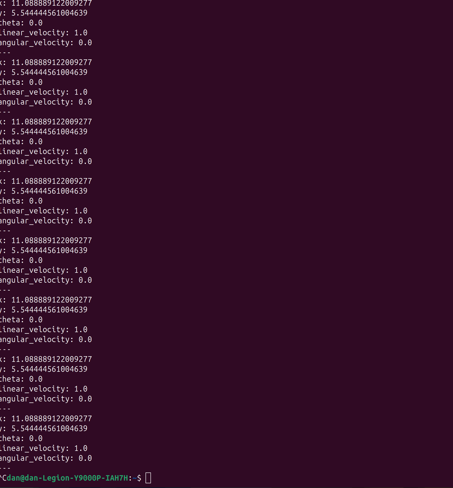

# 📝 Week 3：Python 编程与机器人控制入门
## 实验内容

本周完成了以下任务：

1. 复习 Python 基础知识（数据类型、函数与面向对象类）

2. 学习 ROS2 Python 客户端库 rclpy 的基本结构

3. 编写第一个 ROS2 节点，发布 geometry_msgs/Twist 消息控制机器人运动

4. 探索 PyBullet 物理仿真引擎，实现对差速小车和 Panda 机械臂的控制

## 实验截图

*ROS2 Python 节点成功发布控制指令*

*PyBullet 差速小车仿真运行*

*turtlesim 话题通信验证*

*机器人运动控制仿真结果*

## 运行命令
Bash
# 创建并运行一个简单的 Python 节点
python3 my_first_node.py

# 运行控制小乌龟直行的节点
ros2 run my_package straight_mover

# 在 PyBullet 中启动差速小车模拟
python3 simple_car_sim.py
## 遇到的问题
1. **问题**：在编写 ROS2 节点时发现无法直接调用 rclpy
   **解决**：确保在 Python 类中正确继承了 Node 类，并调用了 super().__init__('node_name')

2.**问题**：PyBullet 环境下小车运动不符合预期
  **解决**：检查 applyExternalForce 或 setJointMotorControl2 的参数设置，确保物理参数（如质量、摩擦力）设置正确

## 学习心得
通过本周学习，我掌握了如何将 Python 的面向对象编程思想应用到 ROS2 节点开发中。我深刻理解了 ROS2 节点本质上就是一个类，通过实例化该类并利用 rclpy.spin() 保持运行，可以实现稳定的消息发布与控制逻辑。此外，PyBullet 这种轻量级仿真工具为快速验证算法提供了极大便利。

## 返回
[← 返回首页](../)
## 遇到的问题与解决

| 问题 | 原因 | 解决方案 |
|------|------|----------|
| turtlesim 窗口闪烁 | WSL2 GUI 渲染不稳定 | 使用 WSLg 或安装 X Server 解决 |
| 话题消息格式错误 | Twist 消息的 JSON 格式不正确 | 严格按 `{linear: {x: 2.0}, angular: {z: 1.8}}` 格式发布 |

## 总结与反思

通过本周实验掌握了 ROS2 话题通信的基本模式。发布 Twist 消息控制乌龟运动是后续所有机器人控制的基础。

[← 返回首页](../)
