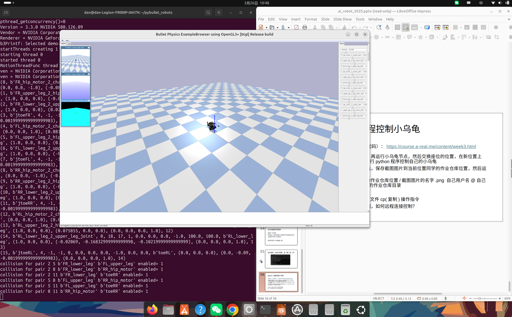

# 📝 Week 4：传感器数据处理与 OpenCV 入门
## 实验内容

本周完成了以下任务：

1. 理解 ROS2 订阅者（Subscriber）：学习如何获取传感器数据，特别是 LaserScan（雷达）和 Image（图像）消息。

2. LiDAR 数据处理：编写节点订阅 /scan 话题，实现简单的避障逻辑（遇到障碍物停止）。

3. OpenCV 视觉基础：学习图像读取、色彩空间转换（RGB/HSV）及基本的图像处理操作。

4. 视觉巡线逻辑：结合 OpenCV 和 ROS2，利用颜色阈值分割（Color Thresholding）寻找路径中心，控制机器人跟随线条。

## 实验截图
LiDAR 避障逻辑实现
OpenCV 图像颜色分割

## 实验截图

*Laikago 四足机器人在 PyBullet 中成功加载*

*仿真环境运行截图*

*LiDAR 传感器数据可视化结果*

*OpenCV 图像颜色分割实验结果*

## 运行命令
Bash
# 查看雷达数据信息
ros2 topic echo /scan

# 运行视觉处理节点
ros2 run my_vision_pkg line_follower

# 使用 OpenCV 在 Python 中读取显示图片
python3 opencv_basic.py
## 遇到的问题
1. **问题**：LiDAR 返回的数据包含大量噪声或 inf（无穷大）值导致程序报错
   **解决**：在代码中加入数据过滤逻辑，对距离值进行有效范围判定（如 if min(msg.ranges) < 0.5）。

2. **问题**：OpenCV 颜色阈值在不同光照下失效
   **解决**：将图像从 BGR 色彩空间转换到 HSV 空间，HSV 对光照变化更具鲁棒性，更容易捕捉特定颜色。

## 学习心得
本周的学习让我从“开环控制”转向了“闭环反馈”。通过订阅雷达数据，机器人有了“触觉”来避开障碍；通过 OpenCV 视觉处理，机器人有了“视觉”来识别路径。我深刻体会到传感器的重要性，以及在处理原始数据（如 360 度的雷达射线或百万像素的图像）时，算法优化的必要性。

## 返回
[← 返回首页](../)
## 遇到的问题与解决

| 问题 | 原因 | 解决方案 |
|------|------|----------|
| PyBullet 导入失败 | 未安装或版本不兼容 | pip install pybullet 并确认 Python >= 3.8 |
| 机器人模型穿透地面 | URDF 初始位置设置不当 | 调整 spawn 位置的 z 坐标到合适高度 |

## 总结与反思

PyBullet 仿真环境为机器人算法开发提供了安全、可复现的测试平台。

[← 返回首页](../)
