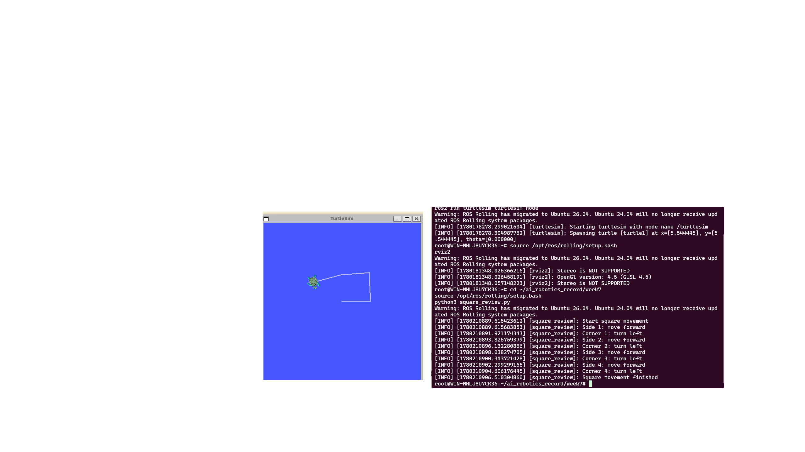
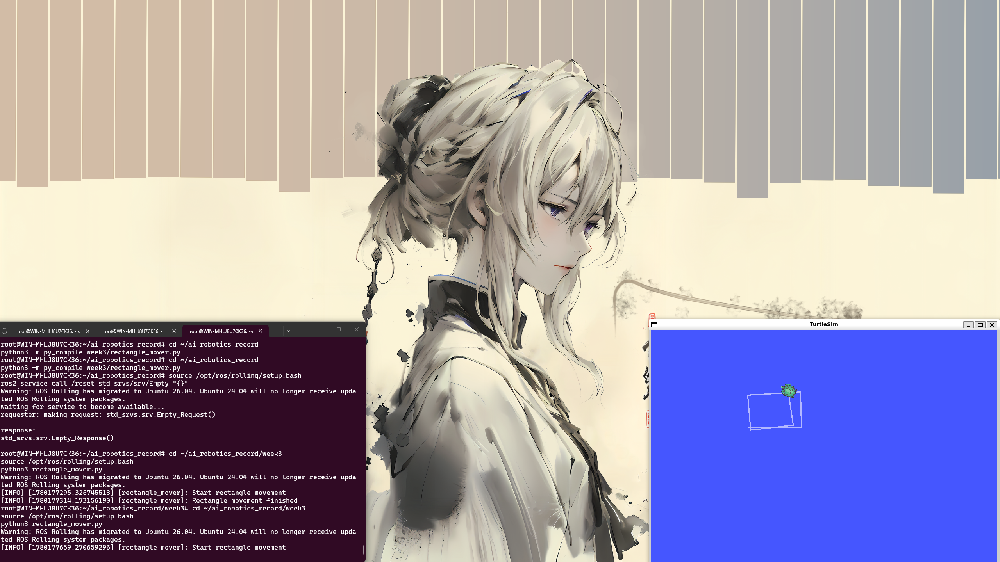

# Week 7 — 期中复习与总结

## 实验内容

本周为前半学期内容的复习与整理，回顾 Week 2 到 Week 6 的核心知识点，包括 ROS2 环境搭建、话题通信、Python 仿真、运动学和 KITTI 可视化。

## 复习要点

### ROS2 基础
- 话题发布/订阅模型（Topic / Publisher / Subscriber）
- 常用命令：`ros2 node list`、`ros2 topic list`、`ros2 topic echo`
- Twist 消息控制机器人运动

### Python 仿真
- PyBullet 基本使用流程：加载模型 → 设置物理参数 → 仿真循环
- URDF 机器人模型格式

### 运动学与可视化
- 坐标系概念：base_link、odom
- RViz2 可视化工具使用
- KITTI 数据集的多传感器数据发布

## 遇到的问题与解决

| 问题 | 原因 | 解决方案 |
|------|------|----------|
| 前期环境配置遗忘 | 间隔时间长未使用 | 整理常用命令速查表，方便快速回顾 |
| 知识点串联困难 | 各周内容相对独立 | 通过综合练习（如乌龟正方形轨迹）串联 |

## 总结与反思

前半学期的学习从环境搭建逐步深入到传感器数据处理，ROS2 的话题通信机制贯穿始终。期中复习帮助我理清了各周内容之间的逻辑关系，为后半学期的 Docker、OpenCV 和期末项目打下基础。

## 实验截图

[← 返回首页](../)

## 延伸思考

期中复习不仅是知识点的回顾，更是一次查漏补缺的机会。通过整理前几周的实验笔记，我发现了自己在 ROS2 话题通信和 Python 仿真方面的薄弱环节，为后半学期的深入学习指明了方向。
