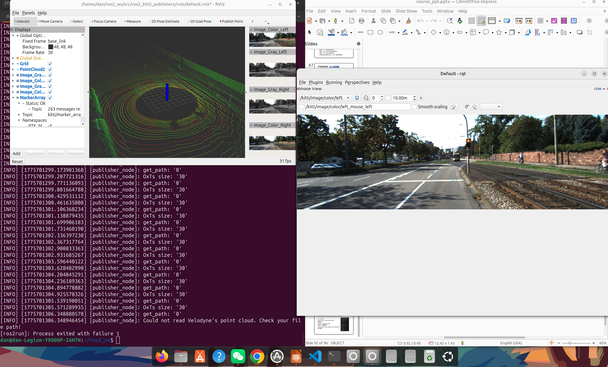

# Week 9 — 机器人与机器视觉数学基础

## 实验目标

理解机器人与机器视觉中的数学基础，包括向量、矩阵、坐标变换、旋转矩阵，以及路径规划算法的基本原理。

## 理论要点

### 旋转矩阵
二维旋转矩阵表示平面中点的旋转：

```
R = [[cosθ, -sinθ],
     [sinθ,  cosθ]]
```

### 机器人运动学
研究机器人位置、速度和关节之间的关系，包括正运动学和逆运动学。

### 路径规划算法
常见算法包括 BFS、Dijkstra、A*、RRT 和 DWA。

### 机器视觉数学
图像矩阵、卷积、特征提取等图像处理基础。

## 编程验证

使用 Python 验证旋转矩阵计算和简单路径规划：

```bash
python3 math_review_demo.py
```


*数学基础程序运行输出*


*路径规划算法验证结果*


*旋转矩阵计算验证*



*数学程序运行过程*

## 遇到的问题与解决

| 问题 | 原因 | 解决方案 |
|------|------|----------|
| 矩阵计算维度不匹配 | 未正确理解矩阵乘法规则 | 仔细检查矩阵的行列数，确保满足乘法条件 |
| 路径规划结果不符合预期 | 启发函数设计不当 | 调整 A* 算法的启发函数权重 |

## 总结与反思

数学基础是机器人算法开发的根基。理解旋转矩阵、坐标变换和路径规划后，才能深入掌握机器人导航和运动控制。

[← 返回首页](../)
